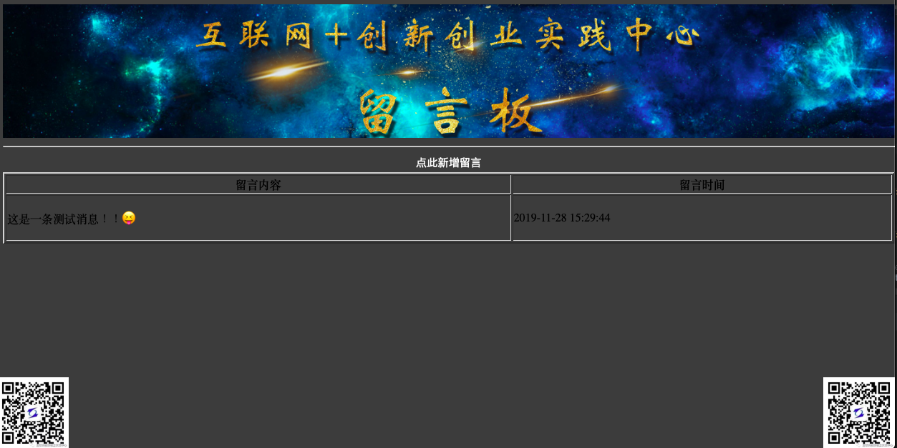
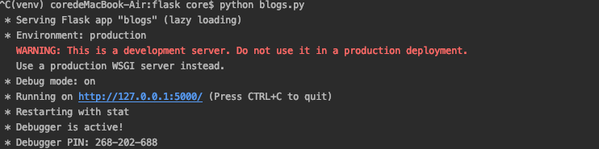

基于flask实现的简单留言版程序
===

# 首页展示
  

# 项目简介
这个小应用使用flask框架来收取实验室对规章制度的建议。
想收取到的意见保存在本地文件，并未使用到数据库。  


如果有问题，请提issue

# 交流分享

- 作者微信  


# 问题集锦

    Q:为什么pull之后运行不起来？
    A:请仔细查看报错信息，有可能是flask包没有安装上。

# 安装flask
### 安装flask框架包  
```
sudo pip install flask
```

### 测试是否安装成功  
```
pip list   中能找到flask
```


# 使用
### 启动Scrapy爬取热点数据

```
python blogs.py
```

### 运行时图片   


# 微信公众号

咖啡是每个程序员的最爱！  
有了咖啡的陪伴，一个人才能度过coding之夜,
有了咖啡的陪伴，一个人的夜晚才算得上是完美。

本人，业余爱好咖啡，  
并经营一些咖啡相关商品，  
如果您也有喝咖啡的习惯，  
赶快来关注我的公众号吧，
---加我有优惠哦---


 


# TODO
- [x] ~~收取实验室成员改制意见~~


---
